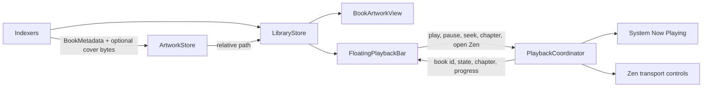

# Avail Liquid Glass Compatibility Design

**Date:** 2026-07-15

**Status:** Implemented and verified

**Branch:** `feature/liquid-glass-ui`

**Base:** `7cc2b74`

## Summary

Avail will keep its macOS 14 deployment target and native desktop information architecture while adopting Liquid Glass on macOS 26 and later. The approved direction combines the richer, artwork-led library canvas from the immersive concept with a persistent floating player inspired by the current macOS Music app.

The design follows Apple's layer hierarchy:

- Liquid Glass belongs to navigation and important interactive controls: the system sidebar, toolbar groups, search field, floating player, and a small number of primary buttons.
- Book artwork, book cards, reading text, settings forms, and inspector content remain in the content layer. They use semantic colors or standard adaptive materials, not Liquid Glass.
- macOS 14 through macOS 25 receive the same layout and interaction model with standard materials and existing button styles. The app does not imitate Liquid Glass with custom blur or shaders.

## Sources and design constraints

SwiftUI API decisions were checked in Context7 against the official SwiftUI collection, `/websites/developer_apple_swiftui`, for:

- `glassEffect`, `GlassEffectContainer`, `glassEffectID`, glass button styles, and availability-safe fallbacks;
- `NavigationSplitView`, `ToolbarSpacer`, `sharedBackgroundVisibility`, toolbar grouping, search placement, and scroll-edge behavior;
- `backgroundExtensionEffect`, concentric shapes, and grouped custom playback controls.

The design also follows these Apple sources:

- [Human Interface Guidelines: Materials](https://developer.apple.com/design/human-interface-guidelines/materials)
- [Human Interface Guidelines: Designing for macOS](https://developer.apple.com/design/human-interface-guidelines/designing-for-macos/)
- [Build a SwiftUI app with the new design](https://developer.apple.com/videos/play/wwdc2025/323/)
- [What’s new in SwiftUI](https://developer.apple.com/videos/play/wwdc2025/256/)
- [Applying Liquid Glass to custom views](https://developer.apple.com/documentation/swiftui/applying-liquid-glass-to-custom-views)
- [Apple's macOS Tahoe Music reference](https://www.apple.com/newsroom/images/2025/06/macos-tahoe-26-makes-the-mac-more-capable-productive-and-intelligent-than-ever/article/Apple-WWDC25-macOS-Tahoe-26-Apple-Music-250609_big.jpg.large.jpg)

The installed macOS 27 SDK confirms that the required SwiftUI APIs are available from macOS 26. The project continues to compile with a macOS 14 deployment target by placing every macOS 26-only reference behind an availability boundary.

## Goals

- Give macOS 26 and later a native Liquid Glass presentation without reducing compatibility.
- Make playback persistently visible in the library through an Apple Music-like floating player.
- Preserve the existing `NavigationSplitView`, separate Zen window, Settings scene, menu commands, keyboard access, and application-wide playback session.
- Make the library visually richer through real local artwork, typography, spacing, selection, and standard adaptive materials.
- Keep the UI legible in light, dark, increased-contrast, reduced-transparency, and reduced-motion configurations.
- Keep all book, artwork, indexing, and speech data local.

## Non-goals

- Changing the minimum supported version from macOS 14.
- Rebuilding the sidebar, toolbar, search field, sheets, or settings controls from scratch.
- Applying Liquid Glass to every book card or behind reading text.
- Adding accounts, cloud artwork lookup, analytics, or any network dependency.
- Replacing the current narration engine or changing playback semantics.
- Replacing the approved two-pane Zen reading layout with an iOS-style tab or bottom accessory pattern.
- Adding ornamental glass morphing when no view hierarchy transition requires it.

## Chosen direction and rejected alternatives

Three directions were considered:

1. **Native restraint:** rely exclusively on automatic system glass. This is the lowest-risk option but does not give playback enough presence.
2. **Focused glass:** retain a quiet content layer and add one floating playback surface. This has the clearest hierarchy.
3. **Immersive glass:** apply glass to navigation, playback, and book cards. This is visually expressive but conflicts with Apple's guidance not to use Liquid Glass in the content layer.

The approved hybrid preserves the expressive composition of option 3 and places option 2's floating player above it. Book covers and adaptive content plates create richness; actual Liquid Glass remains reserved for functional controls and navigation.

## Platform and availability strategy

### macOS 26 and later

- Let `NavigationSplitView`, `.sidebar` lists, system search, toolbars, menus, dialogs, and standard controls adopt the OS-provided appearance automatically.
- Use `ToolbarSpacer` to communicate action grouping rather than drawing toolbar capsules manually.
- Use one `GlassEffectContainer` around the floating player's metadata, transport, and progress/action groups so they share sampling, spacing, and refraction while reading visually as one bar.
- Use regular `.glassEffect` for those player groups because they contain text and sit over changing artwork. Do not use clear glass here.
- Use `.buttonStyle(.glass)` for secondary player actions and `.buttonStyle(.glassProminent)` only for the primary play/pause or recovery action when prominence is semantically warranted.
- Add `.interactive()` only to custom surfaces that directly respond to pointer or keyboard activation.
- Use semantic tint only for the primary action, active state, warning, or destructive state.
- Use concentric system shapes for the player and nested controls where the API fits the container.

### macOS 14 through macOS 25

- Keep the identical view hierarchy, action order, keyboard commands, and responsive sizing.
- Render the floating player with `.regularMaterial`, a restrained semantic separator, and a modest system shadow in a rounded rectangle.
- Keep `.bordered` and `.borderedProminent` button styles.
- Retain the platform's native sidebar, toolbar, search, sheets, and Settings appearance.

### Availability boundary

The compatibility layer will isolate macOS 26-only symbols inside small views or modifiers with `if #available(macOS 26.0, *)`. Feature views consume semantic components such as an adaptive playback surface or adaptive prominent button; they do not scatter availability checks throughout layout code.

The project must still build for `arm64` and `x86_64` with `LSMinimumSystemVersion` and Mach-O minimums at 14.0.

## Visual layer model

| Layer | Surfaces | Treatment |
| --- | --- | --- |
| Navigation and controls | Sidebar, search, toolbar groups, floating player, primary playback buttons | Native Liquid Glass on macOS 26+; standard system chrome/material fallback on older systems |
| Supporting content structure | Book card plates, Zen inspector background, grouped settings forms | Standard adaptive materials or default system backgrounds |
| Primary content | Book covers, titles, authors, reading text, spoken-range highlight | Artwork, semantic colors, typography, spacing; never Liquid Glass |

This distinction remains true even if the content layer appears translucent. A standard material card is not treated as an interactive glass control.

## Library window

### Structure

`LibraryRootView` remains a `NavigationSplitView` with explicit selection. `LibrarySidebar` remains a flat `.sidebar` list with one icon, one title, and at most one secondary line per row. No custom sidebar background is added; macOS 26 supplies its floating glass treatment.

The detail column remains a scrolling adaptive grid. The content background uses system-adaptive colors and lets book artwork supply most of the color. It does not use hardcoded white, an opaque root fill, or custom blur behind the toolbar.

### Search and toolbar

- Attach `.searchable` to the `NavigationSplitView` so the field represents the whole library hierarchy and receives the correct top-trailing Mac placement.
- Keep Import, Listen/Pause, and Open Zen visible and preserve the existing menu commands and shortcuts.
- On macOS 26+, separate Import from the playback/Open Zen group with `ToolbarSpacer(.fixed)`.
- Keep toolbar symbols monochrome unless tint conveys an active primary action or error.
- Remove no system scroll-edge treatment and add no darkening layer behind the toolbar.

### Book cards

Each `BookCardView` becomes a focused content plate rather than a glass control:

- display real local cover art when available;
- display a semantic EPUB or PDF placeholder when artwork is missing or unreadable;
- use `.thinMaterial` in one rounded content plate behind each card; do not add a second material layer behind its metadata;
- use a system accent outline plus shape change or elevation for selection so selection is not color-only;
- preserve title, author, state, context menu, accessibility label, and keyboard focus;
- keep the whole card a standard button with a plain style rather than applying `.glassEffect` to every card.

The grid adds bottom content insets equal to the floating player's occupied region so the final row can scroll fully clear of the overlay.

### Floating player

The floating player appears after Avail has an active playback book and remains visible while that session is playing, paused, buffering, seeking, stopped-but-resumable, or failed. It overlays the lower part of the detail canvas, centered above the window edge, in the same functional layer as the Apple Music player.

The full-width form contains three adjacent groups—metadata, transport, and progress/actions—inside one glass-effect container. Together they read as one coherent bar. It contains:

- local artwork or the same semantic placeholder as the library card;
- book title, author, and current chapter when known;
- previous chapter, approximate 15-second back, play/pause, approximate 15-second forward, and next chapter;
- a progress slider with elapsed and remaining accessibility values;
- an Open Zen action;
- buffering, seeking, and failure status without replacing the controls unnecessarily.

The compact form retains artwork, title, play/pause, and Open Zen. `ViewThatFits` selects the full or compact presentation as the detail column narrows; it does not rely on an iPhone size-class assumption.

The player uses only real actions already supported by `PlaybackCoordinator`. It does not show a volume control because Avail does not own system output volume.

### Empty and first-run states

`ContentUnavailableView`, the system file importer, and the current recovery actions remain. On macOS 26+, only a primary system button may use `.glassProminent`; the entire empty state does not become a custom glass card.

## Zen window

The separate value-driven Zen `WindowGroup` and its `HSplitView` remain. Long-form reading content stays visually quiet and never receives a glass background.

- The inspector keeps a subtle standard material or system pane background, associating it with the current book without competing with the text.
- The transport cluster reuses the same playback action component as the floating library player.
- On macOS 26+, the transport cluster may use grouped Liquid Glass and a glass-prominent play/pause button. Voice, speed, chapter, and progress controls remain standard controls.
- “Return to Narration” uses an adaptive prominent button. Its existing Reduce Motion behavior remains authoritative.
- No second persistent floating player is added to the Zen window; the inspector already fulfills that role.

## Settings, recovery, and launch states

The native `Settings` scene, tab structure, grouped forms, alerts, confirmation dialogs, and file importers remain system components. They receive the current OS design automatically.

Custom glass is not added to settings forms, privacy copy, license rows, progress indicators, destructive confirmation, or loading states. Recovery actions may use the adaptive prominent style when they are the single clear next step.

## Component boundaries

Implementation should keep the availability and player responsibilities small and explicit:

- `UI/Components/AdaptiveGlassSurface.swift`: availability-gated custom glass container/surface and fallback material.
- `UI/Components/AdaptiveProminentButtonStyle.swift`: availability-gated glass-prominent versus bordered-prominent styling.
- `UI/Components/BookArtworkView.swift`: local artwork rendering, placeholder, sizing, clipping, and accessibility.
- `UI/Playback/FloatingPlaybackBar.swift`: responsive full and compact library player composition.
- `UI/Playback/PlaybackTransportControls.swift`: reusable transport actions shared by the library player and Zen inspector.
- `UI/Playback/PlaybackProgressControl.swift`: scrub synchronization and seek-on-release behavior.
- `UI/Library/LibraryRootView.swift`: placement, active-book lookup, toolbar/search wiring, and Open Zen routing.
- `UI/Library/BookCardView.swift` and `LibraryGridView.swift`: content-layer card styling and bottom overlay clearance.
- `PlaybackCoordinator`: authoritative playback state plus current chapter presentation needed by both system Now Playing and in-app playback UI.
- `ArtworkStore`: local derived-artwork persistence and removal; no UI concerns.

Large availability branches must not duplicate the full library or player hierarchy. Only the material/style boundary differs by OS version.

## State and data flow

- `PlaybackCoordinator` remains the single source of truth for the app-wide session.
- `FloatingPlaybackBar` derives the active `LibraryBookRecord` by matching `currentBookID`; it does not create a second playback model.
- Scrubbing owns only temporary local gesture state. While the user is not scrubbing, the slider follows `currentNormalizedWordOffset`; releasing commits one seek through the coordinator.
- Current chapter title is resolved when the active chunk or chapter changes and is exposed as presentation state from the coordinator. The same value feeds the in-app player and system Now Playing metadata.
- `openWindow(value:)` continues to route the current book into the Zen scene.

## Local artwork handling

EPUB indexing already emits optional cover bytes, and `LibraryBookRecord` already has `coverRelativePath`. This implementation completes that local path without expanding into a network metadata feature:

1. `ArtworkStore` validates that cover bytes decode as an image and writes them atomically under Application Support in a per-book derived-artwork location.
2. `LibraryStore` records only the relative artwork path with the book metadata.
3. `BookArtworkView` loads the local image at display time and falls back safely if the file is absent or corrupt.
4. Removing a book removes its derived artwork. Rebuilding an index may replace artwork atomically without touching playback position.
5. PDF books and EPUBs without valid cover data use the semantic placeholder in this scope; PDF first-page thumbnail generation is not added.

Artwork failures never fail book indexing or playback. The cover is decorative metadata, not a prerequisite for listening.

## Accessibility and input

- Every icon-only player action has an accessibility label and a matching `.help` string.
- Playback state, buffering, preparation, and failure are communicated with text or accessibility values, not tint alone.
- The progress slider exposes percentage or elapsed/remaining time and remains keyboard adjustable.
- Existing menu commands and keyboard shortcuts remain available; the floating player is not the only route to playback or Zen.
- Pointer targets use native buttons and focus rings. Custom interactive glass is applied only after layout and shape modifiers.
- System glass and standard materials are allowed to respond to Reduce Transparency and Increase Contrast; no hardcoded opacity is used as the sole legibility mechanism.
- Player insertion/removal uses a short move-plus-opacity transition normally and a cross-fade only when Reduce Motion is enabled. There is no decorative morphing, so `glassEffectID` is intentionally not used.

## Failure and recovery behavior

- Missing or unreadable artwork: show the format placeholder and continue normally.
- Buffering at the indexing frontier: keep the player visible, show “Preparing the next passage,” disable only actions that cannot complete, and resume automatically through existing coordinator behavior.
- Seeking: keep metadata visible and communicate transient seeking state.
- Playback failure: show concise failure status and preserve the existing recovery path; do not dismiss the player without explaining the state.
- Missing active book record: remove the stale player presentation and let the library's existing missing-file/recovery state lead.
- Older macOS runtime: render fallback materials without calling or reflecting macOS 26-only APIs.

## Testing strategy

### Automated

- Keep the complete existing suite passing.
- Add presentation tests for player visibility across stopped, playing, paused, buffering, seeking, and failed states.
- Add coordinator tests for current chapter presentation and its update during chapter navigation.
- Add scrub tests proving that playback progress follows coordinator updates when idle and performs one seek when editing ends.
- Add artwork-store tests for atomic write, replacement, invalid image fallback, missing file fallback, and cleanup on removal.
- Add layout/presentation tests for full and compact player content decisions using testable presentation state rather than pixel snapshots.
- Compile with the macOS 14 deployment target so unguarded macOS 26 API use fails the build.
- Run strict Swift formatting, `git diff --check`, `swift test --parallel`, Release build, packaging, and bundle verification.

### Runtime inspection

On macOS 26 or later:

- verify the sidebar, toolbar, search field, player, pointer reactions, light/dark adaptation, active/inactive window state, and scroll-edge behavior;
- verify the player samples the surrounding content coherently and that related custom glass elements share one container;
- verify Resize, full-screen, keyboard-only, VoiceOver, Increase Contrast, Reduce Transparency, and Reduce Motion behavior.

On macOS 14 through macOS 25, when a test machine or CI runner is available:

- verify launch, library navigation, fallback player material, Settings, Zen, and all playback actions;
- confirm there are no missing-symbol or availability crashes.

## Acceptance criteria

- The package and app bundle continue to declare macOS 14.0 as the minimum.
- On macOS 26+, system navigation and toolbars adopt native Liquid Glass, and the custom floating player uses the native glass APIs.
- On macOS 14–25, the same player and controls work with standard material fallbacks.
- No book card or reading-text surface uses Liquid Glass.
- The floating player never obscures the final library row and has a usable compact form at the minimum window width.
- All player buttons, slider behavior, menu commands, media keys, and Open Zen routing control the single existing playback session.
- Local cover art renders when present; absent or bad artwork cannot prevent indexing or listening.
- Light, dark, contrast, transparency, motion, keyboard, pointer, and VoiceOver behavior remain usable.
- The full automated suite, release build, packaging verification, and strict formatting pass.
- No networking or analytics capability is introduced.

## Repository and delivery

Implementation occurs in `/Users/reom/dev/01_Personal/applications/Avail/.worktrees/liquid-glass-ui` on `feature/liquid-glass-ui`, based on checkpoint commit `7cc2b74`. The repository currently has no configured Git remote, so local commits cannot be pushed until the user supplies a remote URL or authorizes creation of a repository.
